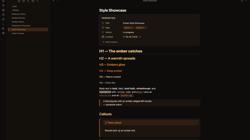

# Ember

A warm, low-glare Obsidian theme — charred near-black in dark mode, warm
parchment in light mode, with an ember-orange accent. Palette inspired by
[gethaunts.app](https://gethaunts.app).



## Fonts

Ember ships with **no bundled or remotely-loaded fonts** — it defaults to your
system font stack, so it works fully offline with zero network calls. For the
intended look, install the three recommended fonts locally (all are free and
open-source) and point Obsidian at them.

| Role | Recommended font | Download |
|------|------------------|----------|
| Body / UI | Hanken Grotesk | [Google Fonts](https://fonts.google.com/specimen/Hanken+Grotesk) |
| Headings | Bricolage Grotesque | [Google Fonts](https://fonts.google.com/specimen/Bricolage+Grotesque) |
| Code | JetBrains Mono | [jetbrains.com/lp/mono](https://www.jetbrains.com/lp/mono/) · [GitHub releases](https://github.com/JetBrains/JetBrainsMono/releases) |

### 1. Download

From each link above, choose **Get font → Download all** (Google Fonts) or grab
the release `.zip` (JetBrains Mono). You'll get a folder of `.ttf` / `.otf`
files.

### 2. Install on your OS

- **macOS (Homebrew)** — the quickest route, no manual download needed:
  ```sh
  brew install --cask font-hanken-grotesk font-bricolage-grotesque font-jetbrains-mono
  ```
- **macOS (manual)** — unzip, select all the font files, double-click and choose
  **Install Font** (or drag them into the *Font Book* app).
- **Windows** — unzip, select all the font files, right-click → **Install for
  all users**.
- **Linux** — copy the font files into `~/.local/share/fonts/` (or
  `/usr/share/fonts/` for all users), then run `fc-cache -f`.

Restart Obsidian after installing so it picks up the newly-available fonts.

### 3. Tell Obsidian to use them

Install the **Style Settings** community plugin, then set the text, heading,
and monospace fonts under **Settings → Style Settings → Ember → Typography** —
type the exact font name (e.g. `Hanken Grotesk`, `Bricolage Grotesque`,
`JetBrains Mono`).

Alternatively set the base interface/text font under
**Settings → Appearance → Font**, and the code font under
**Settings → Appearance → Monospace font**.

> If a named font isn't installed, the theme falls back to the system stack
> automatically — nothing breaks, you just won't see that specific typeface.

## Palette

| Token | Dark | Light |
|-------|------|-------|
| Background | `#0e0c0b` | `#fbf4ea` |
| Surface | `#161109` | `#fffaf2` |
| Text | `#f4ece2` | `#211913` |
| Muted | `#9c9085` | `#6b5d50` |
| Ember (core) | `#e8732c` | `#e8732c` |
| Accent / links | `#ffc26a` | `#b8410f` |
| Selection | ember @ 22% | ember @ 18% |

### Heading ramp
`h1`→`h6` step through a warm ember ramp (glow → amber → ember → deep ember →
muted → dim). `h1` also gets an ember underline. Edit the `--ember-h1`…
`--ember-h6` variables in the `.theme-dark` / `.theme-light` blocks to retune.

## Features

- Full **dark + light** variants, with an HSL-driven palette (every colour
  derives from a few hue/saturation knobs)
- **Style Settings** support — accent (HSL) picker, bundled **Catppuccin** /
  **Nord** palettes, true-black **OLED** mode, font controls, reading measure,
  compact density, reduced-motion and dyslexia-friendly options, plus
  per-element toggles
- **Properties / frontmatter** styled as a calm card with per-type coloured
  icons (date, list, number, checkbox, tags…), themed pills and an optional banner
- **Callouts** ember-tinted per type, sharing one colour language with tasks
  and properties
- **Syntax highlighting** in an ember palette across reading view (Prism) and
  live preview (CodeMirror)
- **Custom task statuses** — 25 Lucide-icon markers, colour-coded, in reading
  view and live preview
- **UI chrome**: command palette, modals, menus, settings, status bar, tooltips
- Styled **embeds**, optional list **relationship lines**, **mobile** polish,
  and light **plugin** theming (Dataview, Kanban)
- Tables, pill tags, ember-edged blockquotes; themed titlebar, tabs, scrollbar
- Ember-highlighted **selected/active rows** in every sidebar

## Task statuses

Use `- [X]` where `X` is one of the markers below. Each renders as a
colour-coded **Lucide** icon, keyed off Obsidian's `data-task` attribute, in
both reading view and live preview. Colours come from the `--task-*` variables.

| Marker | Meaning | Colour | | Marker | Meaning | Colour |
|---|---|---|---|---|---|---|
| `/` | incomplete | amber | | `b` | bookmark | teal |
| `x` | done | ember (struck) | | `i` | information | teal |
| `-` | canceled | muted (struck) | | `S` | savings | green |
| `>` | forwarded | teal | | `I` | idea | amber |
| `<` | scheduling | teal | | `p` / `c` | pros / cons | green / red |
| `?` | question | teal | | `f` | fire | red |
| `!` | important | red | | `k` | key | amber |
| `*` | star | amber | | `w` | win | green |
| `"` | quote | muted | | `u` / `d` | up / down | green / red |
| `l` | location | teal | | `D`/`P`/`M` | PR draft/open/merged | muted/green/purple |

> Markers are drawn as a Lucide SVG `mask` over the checkbox's
> `background-color` (masks render on checkbox inputs in every Obsidian build,
> where pseudo-elements don't). The glyphs are generated from
> [`lucide-static`](https://www.npmjs.com/package/lucide-static) into
> `src/_tasks.scss` — to retune one, swap its Lucide icon there and rebuild.
> A few markers (e.g. `I` = idea) are special-cased by Obsidian core; the full
> set is most reliable alongside the **Tasks** plugin.

## Install / enable

The theme lives at `.obsidian/themes/Ember/`. Enable it via
**Settings → Appearance → Themes → Manage → Ember**, or set
`"cssTheme": "Ember"` in `.obsidian/appearance.json`.

For best results set **Settings → Appearance → fonts** to *Default* so the
theme's fonts win, and the **Accent color** to `#e8732c` (or `#ffc26a`).

## Customising

The easiest route is the **Style Settings** plugin — accent colour, palette
(Ember / Catppuccin / Nord / OLED), fonts, density, reading width, per-element
toggles and accessibility options, all from the settings UI with no CSS editing.

For deeper changes, every colour is a CSS variable. The palette derives from a
small HSL foundation (`--base-h`, `--base-s`, `--accent-h/s/l`) in the
`.theme-dark` / `.theme-light` blocks (prefixed `--ember-*` / `--task-*`).

## Building from source

The theme is written in SCSS and compiled to `theme.css` (the file Obsidian
loads and the one attached to releases).

```sh
npm install
npm run build      # src/*.scss → theme.css
npm run watch      # rebuild on change
```

Partials live in `src/`: `_base` (palette, typography, Style Settings),
`_schemes`, `_tasks`, `_properties`, `_callouts`, `_code`, `_chrome`,
`_embeds`, `_lists`, `_plugins`, `_mobile`; entry point `src/theme.scss`.

## Credits

- Palette inspiration: [Haunts](https://gethaunts.app)
- Fonts: Bricolage Grotesque, Hanken Grotesk, JetBrains Mono (all OFL)
- Task-status marker glyphs use [Lucide](https://lucide.dev) icons (ISC licence),
  the same icon set Obsidian ships
